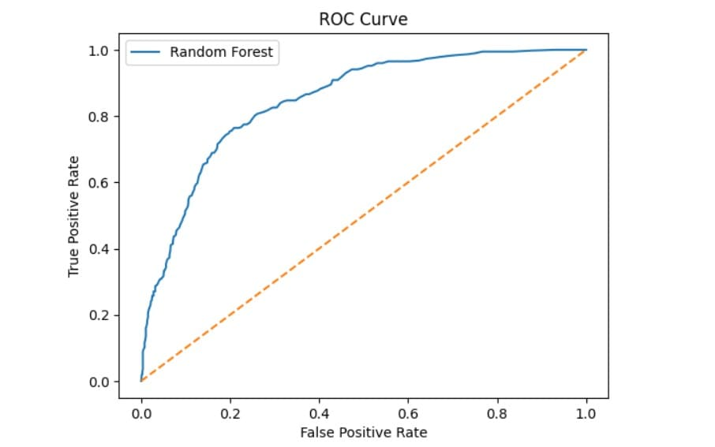
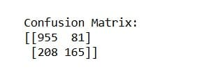
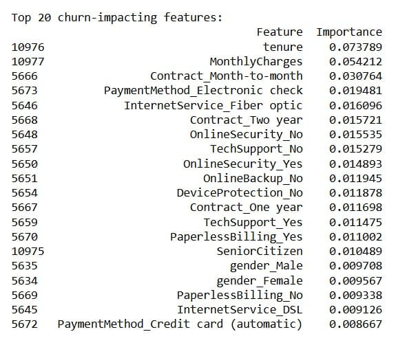

# 📉 Telecom Customer Churn Prediction

This project predicts which telecom customers are most likely to churn using advanced machine learning methods.  
It includes a complete pipeline from **ETL → preprocessing → model training → evaluation → visualization → business insights**.

---

## 📊 Model Evaluation Outputs (Visuals)

### 📈 ROC Curve  
Shows the true-positive vs false-positive performance across thresholds

  

---

### 🧪 Confusion Matrix  
Displays correct and incorrect predictions of churn vs non-churn

  

---

### 🔍 Feature Importance – Churn Drivers  
Shows which features contribute most strongly to customer churn likelihood

  

---

---

# 🧼 ETL & Data Cleaning (telecom_clean.csv)

Performed before training:

✔ Handle missing values  
✔ Convert `Yes/No` to `1/0`  
✔ Remove duplicate rows  
✔ Detect and flag outliers  
✔ Drop zero-variance columns  
✔ Standardize categorical and numeric formats  

Final cleaned dataset: **telecom_clean.csv**

---

# 🧠 Machine Learning Pipeline

### ✔ Training & Evaluation
- Train/test split: 80% train, 20% test
- Models used:
  - Logistic Regression
  - Random Forest Classifier (best performance)
- Metrics evaluated:
  - Precision
  - Recall
  - F1-Score
  - ROC-AUC

### 🎯 Best Model Result
- ROC-AUC ≈ 0.91 (Random Forest)

  
---

# 🔍 Business Insights From Feature Importance

The model shows that **churn risk increases when customers:**

- Have month-to-month contracts  
- Have short tenure & low loyalty  
- Pay higher monthly charges  
- Lack technical support  
- Use certain payment methods  
- Lack online security services  

💡 These are actionable insights for:
- Retention strategy  
- Customer segmentation  
- Predictive marketing  
- Targeted discount & loyalty offers  

---

